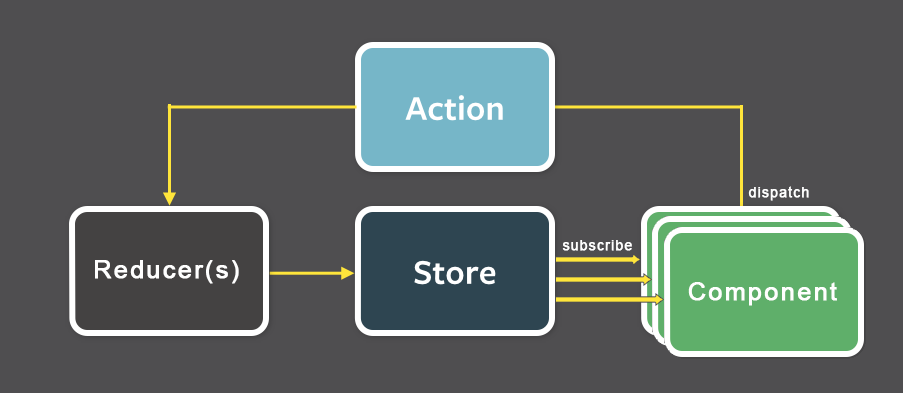

# State
Spencer Schneidenbach

---

# Props vs state

---

# Props vs state
Props are given to the component  
State is managed by the component

---

# state
```jsx
class Test extends React.Component
{
    constructor(props) {
        super(props);
        this.state = {
            firstName: "spencer"
        };
    }

    render() {
        return (
            <div>
                Hello {this.state.firstName}!
            </div>
        );
    }
}
```

---

## When to mutate state?
* in response to events
* during lifecycle hooks

---

# Lifecycle hooks

(demo)[https://stackblitz.com/github/Oblosys/react-lifecycle-visualizer/tree/master/examples/parent-child-demo?file=src/samples/New.js]

---

## Don't do this

* mutate state directly
* mutate state in `render()` method

---

# Event handlers
Spencer Schneidenbach

---

[`SyntheticEvent`](https://reactjs.org/docs/events.html)

---

```jsx
class Test extends React.Component
{ ... }

class AppComponent extends React.Component
{
    render() {
        return [
            <Test />
            <Test />
        ];
    }
}
```

---

[demo](https://jsfiddle.net/schneidenbach/maqb3sz4/)

---

# Redux
Spencer Schneidenbach

---


---



---

# Demo
